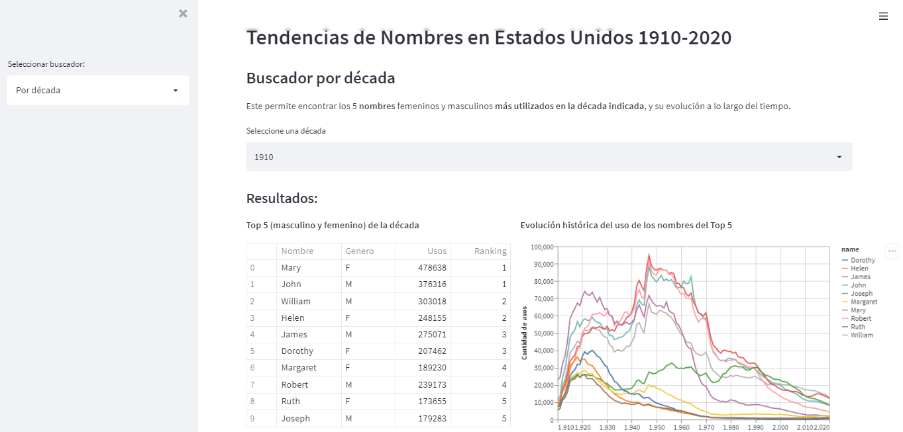
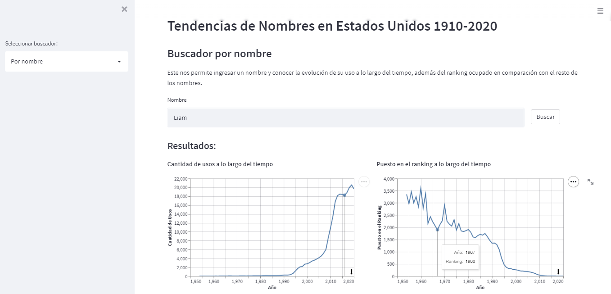
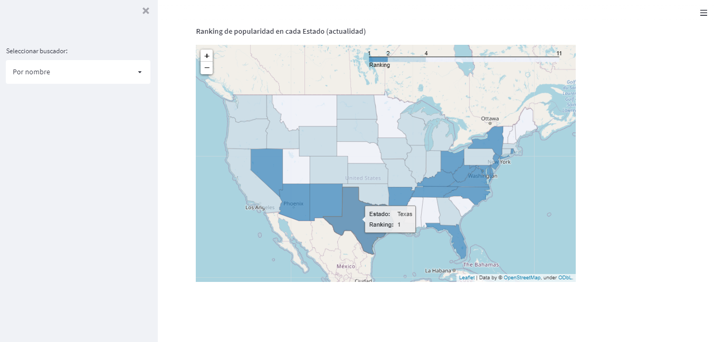

# Tendencias de Nombres en Estados Unidos (1910-2020)
Este proyecto se basa en la construcción de un buscador de tendencias en los nombres de personas en los Estados Unidos, desde el 1910 a la actualidad, a partir de los datos públicos disponibles en [USA Name Data - Dataset de BigQuery](https://www.kaggle.com/datasets/datagov/usa-names?select=usa_1910_current).

El mismo se puede encontrar en: [WebApp Tendencia Nombres USA](https://share.streamlit.io/livramentoluciano/data-science-practices/main/usa-name-trends/app/app.py)

## Funcionalidad
Esta pequeña aplicación consta de 2 buscadores:
- **Buscador de nombres tendencia de cada década:** simplemente se selecciona una década e indicará los 5 nombres masculinos y femeninos más recurrentes en la misma, como así también la evolución histórica de su uso.
- **Buscador por nombre:** por medio de este se puede ingresar un nombre y el programa nos mostrará la evolución de su uso a lo largo del tiempo, tanto en cantidad como en ranking correspondiente (uso en comparación con el resto de los nombres del mismo año). Además, se presenta un mapa de calor geográfico en el cual se visualiza la popularidad del nombre en cada uno de los estados de USA, en la actualidad.

ToDo's: 
- Timelapse: gráfico dinámico con el ranking top 5 de nombres tendencia a lo largo del tiempo (que se pueda observar como cada nombre va bajando/subiendo en el ranking al pasar los años, o bien como nuevos nombres aparecen en el ranking).
- Buscar forma de presentar al usuario sugerencias sobre el por qué un nombre fue tendencia en cierta época (ejemplo, Diana -> Lady di)

## Screenshots
- Video app

https://user-images.githubusercontent.com/27143242/166294734-d035791f-3d44-41a1-8d30-cf47a59a4352.mp4

- Buscador por década

- Buscador por nombre

## Tecnología
Para desarrollar esta aplicación web se utilizó la librería `Streamlit` de Python, la cual permite construir pequeñas apps que faciliten la visualización de datos en proyectos de Data Science y Machine Learning.
- SQL/BigQuery
- Python/DataVisualization/Streamlit

## Notas
- Recordar `requirements.txt` para correcto funcionamiento de Streamlit
    - Utilizar la versión correcta de Python al deployear (en función de las librerias utilizadas)
- Al intentar graficar un *st.line_chart* con un dataframe *wide* (pivoteado) arrojaba error. Para solucionarlo se utilizó `altair` (librería gráfica) junto con streamlit. También podría haberse resuelto con el dataframe pivoteado y utilizando pyplot. Las referencias para la solución se encuentran en los siguientes enlaces:
    - https://github.com/streamlit/streamlit/issues/3386
    - https://discuss.streamlit.io/t/st-line-chart/767/3
    - https://altair-viz.github.io/user_guide/encoding.html
- Tutorial para deploy mediante Streamlit, con Bigquery integrado: [https://docs.streamlit.io/knowledge-base/tutorials/databases/bigquery]
