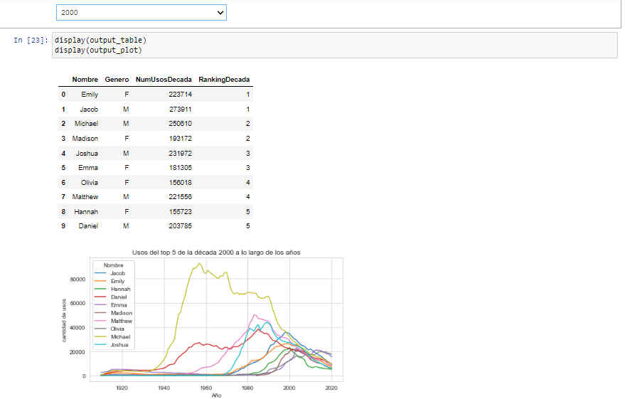
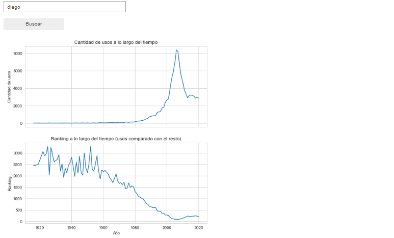

# Tendencias de Nombres en Estados Unidos (1910-2020)
Este proyecto se basa en la construcción de un buscador de tendencias en los nombres de personas en los Estados Unidos, desde el 1910 a la actualidad, a partir de los datos públicos disponibles en [USA Name Data](https://www.kaggle.com/datasets/datagov/usa-names?select=usa_1910_current) (*Dataset* de *BigQuery*).

## Funcionalidad
Esta pequeña aplicación consta de 2 buscadores:
- **Buscador de nombres tendencia de cada década:** simplemente se selecciona una década e indicará los 5 nombres masculinos y femeninos más recurrentes en la misma.
- **Buscador por nombre:** por medio de este se puede ingresar un nombre y el programa nos mostrará la evolución de su uso a lo largo del tiempo, tanto en cantidad como en ranking correspondiente (cantidad en comparación con el resto de los nombres del mismo año).

ToDo's: 
- Timelapse: gráfico dinámico con el ranking top 5 de nombres tendencia a lo largo del tiempo (que se pueda observar como cada nombre va bajando/subiendo en el ranking al pasar los años, o bien como nuevos nombres aparecen en el ranking).
- Buscar forma de presentar al usuario sugerencias sobre el por qué un nombre fue tendencia en cierta época (ejemplo, Diana -> Lady di)

## Contenido adicional. Estructura.
Además de la pequeña aplicación interactiva, este proyecto cuenta con un análisis completo de los datos en cuestión. Para una mejor comprensión de este análisis, se dividió al mismo en 2 archivos:
- *data_analysis_overview*
- *names_analysis*

### Data Analysis Overview
En este archivo se puede encontrar un análisis demográfico exhaustivo con todo tipo de gráficos, echando luz sobre distintos aspectos de la natalidad en Estados Unidos, a lo largo de los años y de su geografía. Se pueden observar cuestiones como:
- Cantidad de nacimientos registrados desde 1910.
    - Distinción por género. Acumulado total y evolución anual.
    - Distinción por Estado. Evolución anual de cada Estado. Análisis particular de los Estados con mayor cantidad de nacimientos registrados.
    - Combinación de anteriores, observando evolución anual y por Estado de la relación hombres/mujeres nacidxs.
    
### Names Analysis
Por otra parte, en este archivo el análisis se centra en los nombres elegidos por los estadounidendes, observándose cuestiones como:
- Cantidad total de nombres utilizados en la historia. Distinción por género.
- Evolución en el tiempo de la variedad de nombres utilizados. Distinción por género.
- Nombres más utilizados en la historia y en la actualidad. 
    - Evolución a lo largo del tiempo.
    - Uso a lo largo del territorio.

## Screenshots
- Buscador por década

- Buscador por nombre

## Tecnologías aplicadas
Entre las herramientas tecnológicas utilizadas, se pueden destacar:
- SQL/BigQuery
- Python/Seaborn/GUI (Interface)
